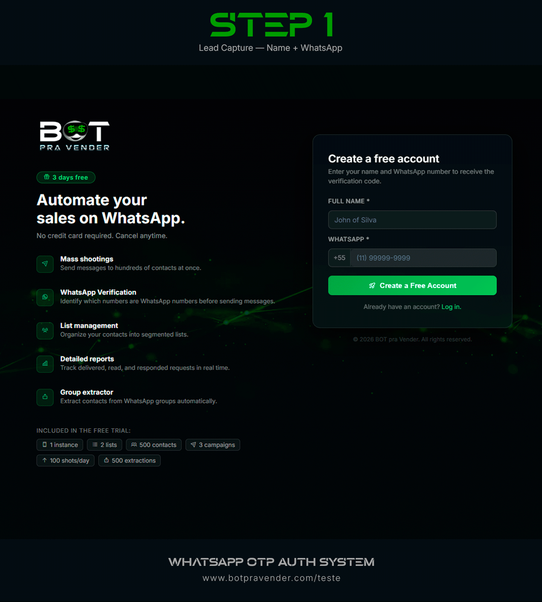
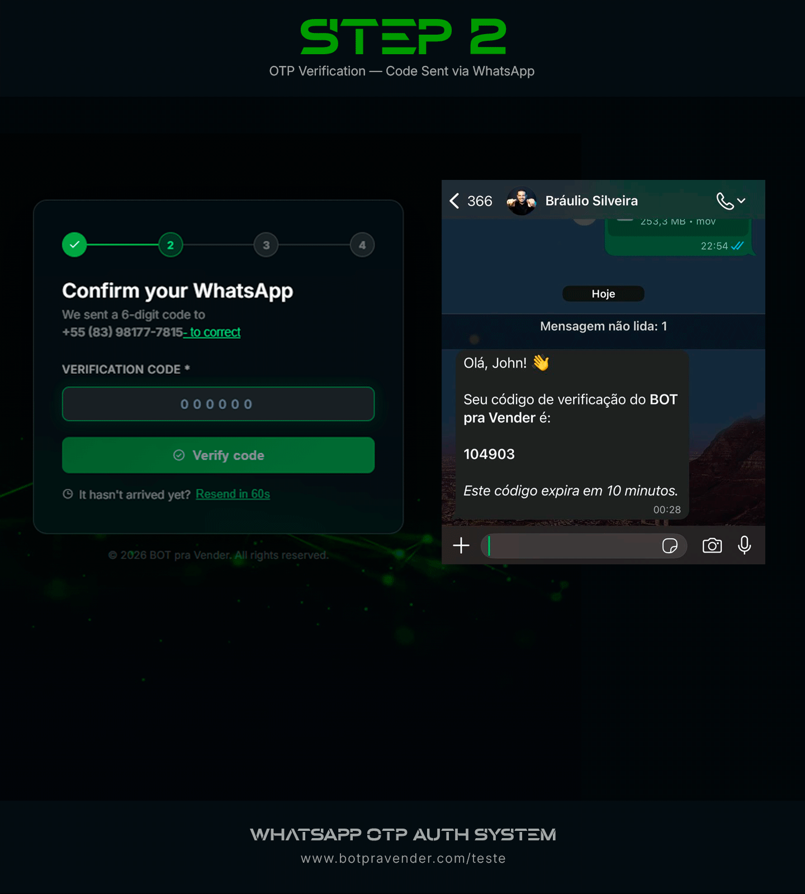
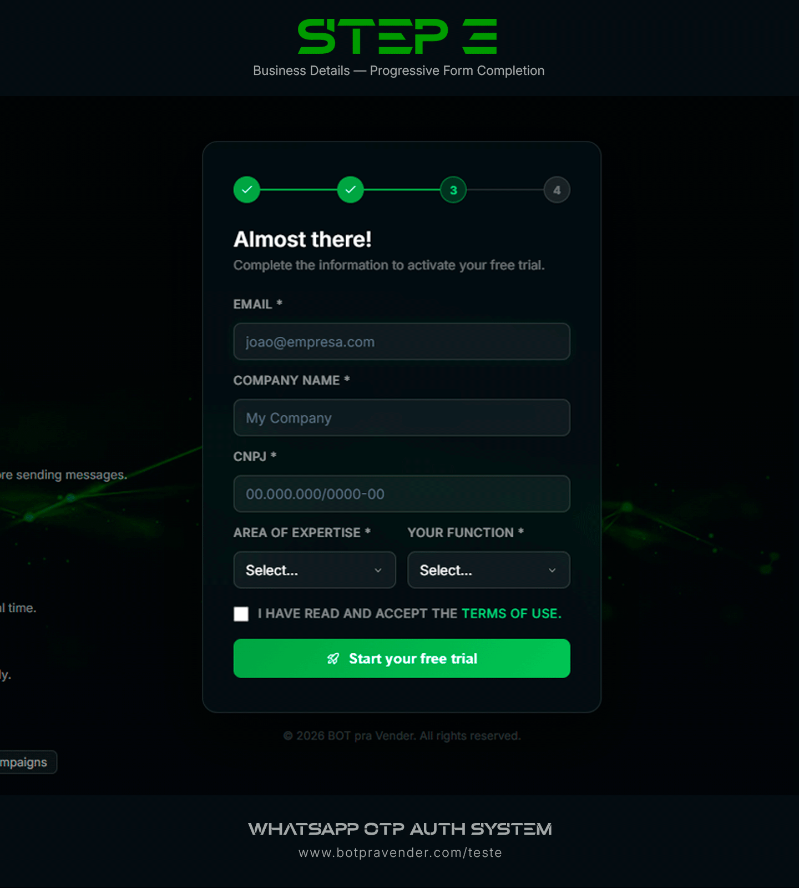
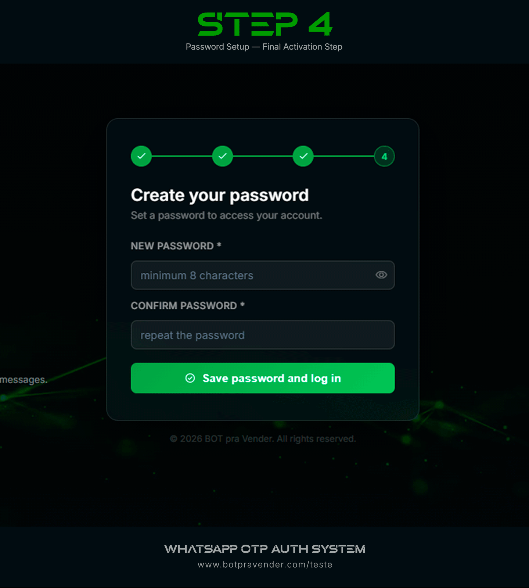
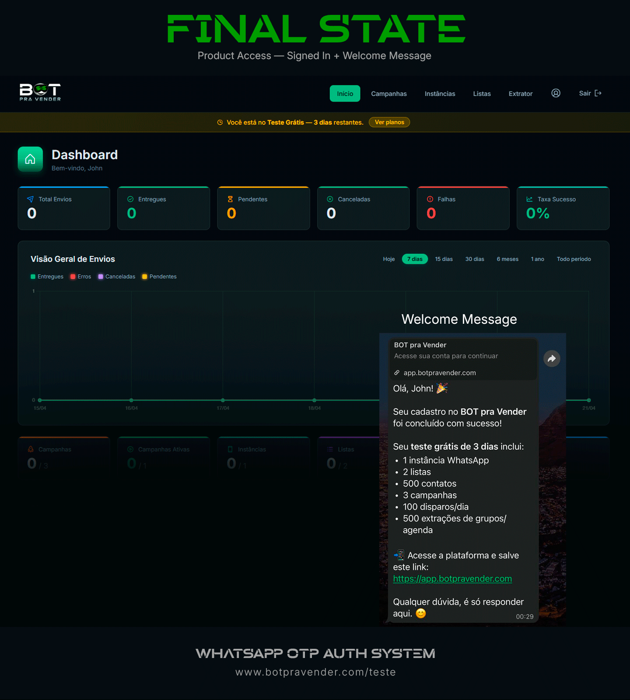

# WhatsApp OTP Auth System

A production-grade onboarding and identity-verification flow built around WhatsApp OTP, designed to improve conversion, validate real phone ownership, and provision free-trial accounts inside a multi-tenant SaaS platform.

This repository is presented as a public portfolio case study for recruiters, hiring managers, and founders evaluating product-minded engineering work. It highlights the product strategy, system design, onboarding UX, and reliability considerations behind the feature, while keeping the full source code private for commercial and security reasons.

## Executive Summary

This project rethinks trial activation as a trust-building onboarding system rather than a basic signup form.

Instead of collecting a large set of fields upfront, the flow starts with the smallest possible commitment: name and WhatsApp number. From there, the system validates whether the number is actually on WhatsApp, delivers a one-time password through the same channel, and only then reveals the remaining account-creation steps.

That sequence improves two things at once:

- conversion, by reducing first-step friction;
- trust, by verifying that the user actually controls the submitted number.

From a product and engineering perspective, the flow was designed to:

- The user submits their name and WhatsApp number.
- reduce signup friction at the top of the funnel;
- verify real ownership of the submitted WhatsApp number;
- increase completion rates through progressive step-based onboarding;
- provision the trial tenant only after meaningful verification has happened;
- move the user directly from signup into an activated, signed-in product experience.

The end result is a more credible, conversion-aware onboarding architecture that can be reused anywhere a system needs stronger confidence in phone-based identity before granting deeper access.

## The Problem

Self-serve onboarding tends to underperform when:

- users sign up with invalid or unreachable numbers;
- the verification channel is disconnected from the product's main use case;
- activation depends on too many steps across different channels;
- low-intent signups inflate the funnel but do not convert;
- trial provisioning is loosely controlled.

Because this SaaS product is built around WhatsApp operations, validating the user's WhatsApp presence at the start of the funnel creates a stronger and more relevant onboarding process than a traditional email-first flow.

The core idea is simple but powerful: if the user can receive and confirm a WhatsApp OTP on that number, the system has much stronger evidence that the submitted number is real and belongs to the person starting the trial. That same principle is useful across many systems that need better trust during onboarding.

## What I Built

- A free-trial landing page optimized for conversion
- A multi-step onboarding wizard
- Progressive disclosure of form fields across onboarding steps
- WhatsApp OTP delivery and verification
- Number existence validation before OTP generation
- Temporary signed session flow after OTP validation
- Automatic company and trial provisioning
- Password setup and final activation inside the same journey
- Automatic sign-in and redirect into the product after password creation
- WhatsApp welcome message with trial limits and access link
- OTP resend and activation resend flows
- Abuse-prevention rules such as cooldowns and rate limits
- Error handling designed for users, without exposing internal implementation details

## Conversion Strategy

This feature was intentionally designed as a step-based onboarding funnel rather than a single long form.

The first screen asks only for:

- name;
- WhatsApp number.

That matters because shorter forms usually convert better. Instead of asking for every business field upfront, the flow reduces friction at the moment of highest drop-off risk: the first interaction.

Only after the user confirms the OTP sent to their WhatsApp does the system reveal the next step and request the rest of the company information. By then, the user has already invested effort in the process and has proof that the onboarding is real, which increases the likelihood of completion.

The final step asks the user to create and confirm a password. Once completed, the system signs the user in automatically, redirects them into the application, and sends a WhatsApp welcome message with:

- free-trial limits;
- product access link;
- a fallback path in case the user forgets the URL later.

This creates a smoother transition from signup to activation and removes an extra login barrier immediately after onboarding.

## Onboarding Psychology

The flow also leverages a simple but effective behavioral principle: once users feel they have already made meaningful progress, they are more likely to continue.

In practice, the onboarding sequence works like this:

- Step 1: a low-friction entry point with just name and WhatsApp;
- Step 2: real-number verification through WhatsApp OTP;
- Step 3: completion of the remaining business fields;
- Step 4: password creation and immediate entry into the system.

That progression helps create momentum. Instead of confronting the user with a heavy form from the beginning, the flow gradually increases commitment after each successful step.

## Technical Flow

### 1. Lead capture

The user lands on the free-trial page and submits their name and WhatsApp number. The frontend handles input masking, basic validation, and step-by-step feedback.

### 2. WhatsApp number validation

Before generating the OTP, the backend checks whether the submitted number is actually on WhatsApp. This prevents invalid signups from entering the funnel and improves downstream account quality.

### 3. OTP delivery via WhatsApp

If the number is valid, the system generates a 6-digit OTP with a short expiration window and sends it through a connected WhatsApp instance. The flow also includes:

- resend cooldowns;
- per-phone attempt limits;
- additional IP-based rate limiting on sensitive endpoints.

### 4. Verified session token

After successful OTP verification, the backend issues a temporary signed token so the user can continue onboarding securely without re-verifying the phone number at every step.

### 5. Trial provisioning

Once the business form is completed, the backend:

- checks for duplicate email addresses;
- finds or creates the `Free Trial` plan;
- creates a tenant in trial mode;
- sets the trial expiration date;
- creates the auth user;
- links the profile to the tenant.

### 6. Final activation

In the final step, the user sets a password and the trial environment is activated. The flow was designed to be resilient, including cleanup logic for partial failures during provisioning.

## Free Trial Rules

The trial provisioned by this feature includes:

- 3 free days
- 1 WhatsApp instance
- 2 contact lists
- 500 contacts
- 3 campaigns
- 100 sends per day
- 500 group or address-book extractions

## Key Engineering Decisions

### Use WhatsApp as the verification channel

Instead of relying on email as the primary verification path, the flow verifies users through the exact channel the product depends on. This makes the onboarding experience more aligned with actual product usage and creates stronger confidence that the user truly controls the number they submitted.

### Validate the number before generating the OTP

The system checks whether the phone number is present on WhatsApp before sending the code. This reduces waste, improves lead quality, and avoids provisioning accounts for unreachable users.

### Separate OTP validation from account provisioning

OTP verification grants a temporary signed session, while provisioning happens later. This separation keeps the flow flexible and easier to reason about, while still enforcing security boundaries between steps.

### Keep activation idempotent

The final activation step is designed so repeated requests do not break account state. This matters in real-world onboarding where users refresh pages, retry actions, or return from interrupted flows.

### Fail safely during provisioning

The flow includes cleanup behavior for partial failures so the system does not leave behind inconsistent trial tenants or orphaned auth records.

### Use step-based progressive disclosure

The onboarding flow collects the smallest possible amount of information first, then reveals the remaining fields only after WhatsApp verification succeeds. This improves conversion while also increasing trust in the submitted identity before asking for deeper account details.

## Challenges and Trade-Offs

### Friction vs. trust

Adding verification always introduces some friction. The trade-off here was intentional: slightly more effort at signup in exchange for much higher trust in the quality of created accounts.

### Reliability vs. dependency on external messaging infrastructure

Using WhatsApp as the OTP channel creates a stronger product fit, but it also introduces operational dependency on messaging infrastructure. To reduce risk, the flow includes retries, instance fallback behavior, and user-facing recovery paths.

### Fast onboarding vs. abuse prevention

A frictionless trial funnel can be abused. This implementation balances conversion with cooldowns, per-number limits, and IP-based protections, aiming to reduce spam without making legitimate users feel punished.

### Product clarity vs. implementation secrecy

Because this repository is public and intended for portfolio use, the documentation focuses on architecture and decision-making rather than exposing internal source code, secrets, or operational details.

## Security and Abuse Prevention

This project includes several defensive layers:

- short-lived OTP expiration;
- max attempt rules for incorrect codes;
- resend cooldowns;
- phone-based rate limiting;
- IP-based rate limiting on sensitive endpoints;
- signed temporary tokens after verification;
- user-safe error messages that avoid leaking internals.

## Why This Project Matters

From a portfolio perspective, this project demonstrates more than just implementation:

- product-aware backend design;
- onboarding architecture for SaaS;
- integration with external communication channels;
- multi-tenant provisioning logic;
- defensive engineering for user-facing systems;
- the ability to think in terms of conversion, trust, and operational reliability.

It also demonstrates a reusable onboarding pattern: verifying real ownership of a submitted WhatsApp number before granting access, creating a trial, or allowing the user deeper into the system.

## Stack

- Nuxt 4
- Vue 3
- Supabase Auth
- Supabase Database
- Nitro server routes
- WhatsApp API integration for number validation and OTP delivery

## High-Level Architecture

```text
Landing page / Onboarding wizard
              |
              v
        Nuxt frontend
              |
              v
       Nitro API routes
              |
              +--> WhatsApp number validation
              +--> OTP generation and verification
              +--> Rate limiting and signed temporary tokens
              +--> Trial tenant provisioning
              +--> Final account activation
              |
              v
   Supabase Auth + Database
```

## Demo and Media

This repository is meant to be supported by visual proof of execution. I will add:

- product screenshots;
- short demo videos;
- walkthroughs of the OTP validation flow;
- onboarding and trial activation clips.

Recommended media structure:

- `Screenshot 1`: free-trial landing page
- `Screenshot 2`: OTP verification step
- `Screenshot 3`: additional business fields
- `Screenshot 4`: password creation step
- `Screenshot 5`: signed-in product state plus welcome WhatsApp message
- `Video demo`: end-to-end onboarding walkthrough

## Media Hosting and Format Recommendations

For a GitHub portfolio repository, the recommended setup is:

- screenshots stored inside the repository under `./media/`;
- video hosted as either a GitHub attachment URL or an unlisted YouTube link.

Recommended image format:

- `PNG` for UI screenshots;
- `WEBP` if you want smaller files with good visual quality.

Recommended image size:

- width between `1440px` and `1600px` for desktop screenshots;
- around `1080px` width if you are exporting narrower step-focused screens;
- ideally between `200 KB` and `800 KB` per image.

Recommended video format:

- `MP4`
- `1280x720`
- `30s` to `90s`

Avoid committing large video files directly into the repository unless they are very small. For GitHub portfolio purposes, links usually work better than storing the raw video in git.

## Media Placeholders

Use this section as soon as the assets are uploaded to the repository or attached through GitHub-friendly URLs.

### Screenshots











### Video Demo

[Watch the full demo](https://github.com/user-attachments/assets/your-video-id)

### Suggested Asset Structure

```text
media/
  free-trial-landing-page.png
  otp-step-and-whatsapp-code-message.png
  additional-business-fields.png
  password-creation-step.png
  signed-in-state-and-welcome-message.png
```

## About This Repository

This repository was created to present the feature as a portfolio case study for product engineering and SaaS-focused roles.

It is public so recruiters, founders, and hiring teams can evaluate the scope and quality of the work. The complete source code, internal integrations, secrets, and infrastructure details remain private for commercial and security reasons.

## My Role

I designed and implemented this feature end-to-end, including:

- onboarding UX;
- validation rules;
- OTP authentication logic;
- WhatsApp integration;
- trial provisioning flow;
- final activation flow;
- failure handling and abuse-prevention strategy.

## Contact

If you would like a live walkthrough or want to discuss product engineering, backend architecture, SaaS onboarding, or full-stack roles, feel free to reach out.
